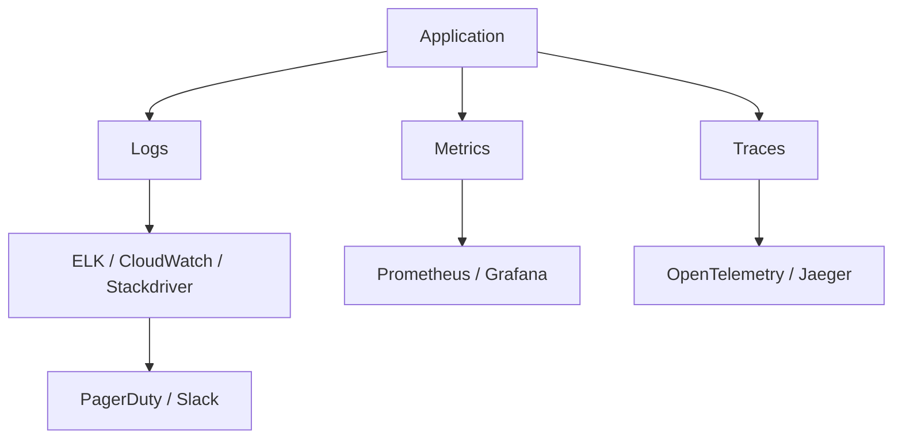

# templates/observability_runbook.jinja2

You are a **staff-level SRE** tasked with producing a production-grade **Observability Runbook**.  
The output must:  
- Be written as if reviewed by senior architects and CTOs.  
- Cover **multi-cloud observability, automation, resilience, security, compliance, cost, runbook, and risks**.  
- Provide **complete YAML/Prometheus/OpenTelemetry snippets**.  
- Use structured markdown with clear sections.

---

## 1) Executive Summary
- **Prompt:** sample-prompt  
- **Tool:** Observability Runbook  
- **Cloud/Runtime:** sample-cloud  
- **Prior Conversation Context:** sample-conversation  

This **runbook** defines **observability practices** for workloads in **multi-cloud (AWS, Azure, GCP)**. It covers **metrics, logs, tracing, SLOs**, IaC automation with **Terraform + GitHub Actions + ArgoCD**, **HA (multi-AZ, fault tolerant)** monitoring pipelines, **IAM least privilege + KMS**, compliance with **PCI, ISO 27001, HIPAA, GDPR**, cost efficiency, risks, trade-offs, and **quick wins/gotchas**.

---

## 2) Architecture Diagram


---

## 3) Core Architecture
- **Automation**: Terraform to provision Prometheus/Grafana/ELK, ArgoCD to manage configs, GitHub Actions for CI/CD.  
- **Resilience**: HA observability stack across multi-AZ, DR with RPO/RTO for monitoring.  
- **Security**: IAM least privilege, encrypted log storage with KMS.  
- **Compliance**: PCI, ISO 27001, HIPAA, GDPR.  
- **Cost**: rightsizing observability infra, log retention policies.  

---

## 4) Production-Grade Examples

### Prometheus Rule
```yaml
groups:
- name: cpu-alerts
  rules:
  - alert: HighCPUUsage
    expr: avg(rate(container_cpu_usage_seconds_total[5m])) > 0.9
    for: 5m
    labels:
      severity: critical
    annotations:
      summary: "High CPU usage detected"
      description: "Container CPU > 90% for 5 minutes"
```

### OpenTelemetry Collector Config
```yaml
receivers:
  otlp:
    protocols:
      grpc:
      http:
exporters:
  logging:
  otlp:
    endpoint: otel-collector:4317
service:
  pipelines:
    traces:
      receivers: [otlp]
      exporters: [logging, otlp]
```

---

## 5) Observability & Monitoring
- **Metrics**: Prometheus, CloudWatch, Stackdriver.  
- **Logs**: ELK/CloudWatch centralization.  
- **Tracing**: OpenTelemetry end-to-end.  
- **SLOs**: uptime ≥ 99.9%, error rate <1%.  

---

## 6) Security & Compliance
- IAM least privilege for monitoring roles.  
- KMS encryption of logs/traces.  
- Compliance: PCI, ISO 27001, HIPAA, GDPR.  

---

## 7) Runbook – Step-by-Step Troubleshooting
1. Check service health dashboards.  
2. Inspect logs for recent errors.  
3. Query metrics in Grafana.  
4. Trace requests in Jaeger.  
5. Escalate if SLO breach detected.  

---

## 8) Risks, Trade-Offs & Limitations
| Risk | Mitigation |
|------|------------|
| Log explosion costs | Retention + sampling |
| Gaps in tracing | OTel auto-instrumentation |
| Metric cardinality | Enforce limits |
| Compliance failures | Encrypted storage + audits |

---

## 9) Cost Optimizations
- Retain logs for 30d, archive after.  
- Sample traces in high-volume services.  
- Rightsize monitoring clusters.  
- KPI: cost per 1M logs ingested.  

---

## 10) Quick Wins & Gotchas
- Add SLO dashboards now.  
- Enable OTel auto-instrumentation.  
- Weekly KPI reports (cost, error rate).  
- Automate retention policies.  

**Gotchas:**  
- Retention misconfigurations can silently increase cost.  
- Missing tracing headers breaks end-to-end visibility.  

---

## ✅ End of Template