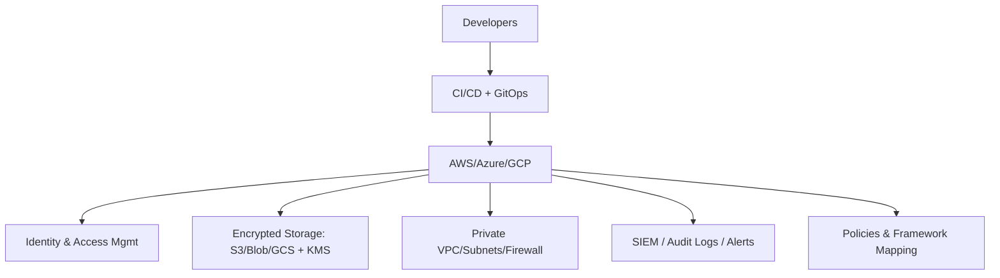

You are a staff-level Cloud Security & Compliance Engineer writing a **Security & Compliance Playbook**.  
The goal is to ensure cloud workloads are hardened, auditable, and compliant with major standards.

Prompt: sample-prompt
Tool: Cloud Security & Compliance

---
## 1) Executive Summary
This playbook provides a structured guide for aligning cloud infrastructure  
with **PCI DSS, ISO 27001, HIPAA, and GDPR**.  
It covers IAM, encryption, observability, automation, and governance.  

---
## 2) Architecture Diagram

---
## 3) Runbook: Step-by-Step

### a) IAM & Access Controls
- Enforce **least privilege** with role-based access.  
- Use SSO/Identity Federation (Azure AD, IAM Identity Center).  
- Rotate keys, avoid long-lived secrets.  
- Apply break-glass accounts for emergencies only.  

### b) Data Security
- Encrypt at rest with **KMS/CMK** across AWS/Azure/GCP.  
- Encrypt in transit (TLS 1.2+).  
- Mask or tokenize PII data (GDPR/PCI).  
- Configure default block-public access for storage buckets.  

### c) Compliance Guardrails
- Automate compliance scanning:  
  - AWS Config + Security Hub  
  - Azure Policy + Defender for Cloud  
  - GCP Security Command Center  
- Map controls to PCI, HIPAA, ISO, GDPR.  
- Store evidence artifacts for audits (screenshots, reports).  

### d) Observability & Logging
- Centralize logs to SIEM (Splunk, ELK, Cloud-native).  
- Enable CloudTrail / Activity Logs / Audit Logs.  
- Monitor IAM anomalies, network egress, and privilege escalation.  
- Set up retention policies aligned with compliance requirements.  

### e) Automation
- Enforce policies as code (OPA/Gatekeeper, Sentinel, Conftest).  
- Deploy IaC guardrails (Terraform with compliance modules).  
- Use GitHub Actions/Azure DevOps to enforce checks pre-deploy.  

---
## 4) Risks & Trade-offs
❌ Manual compliance checks → drift & audit failures → ✅ automate with policy-as-code.  
❌ Over-restrictive IAM → developer slowdown → ✅ tiered access.  
❌ Log everything → cost explosion → ✅ balance retention vs cost.  
❌ Vendor lock-in (security services) → ✅ use multi-cloud control plane where possible.  

---
## 5) Compliance & Governance
- PCI DSS: network segmentation, quarterly scans.  
- HIPAA: encryption of PHI, audit trails.  
- GDPR: right to be forgotten, data residency.  
- ISO 27001: risk management, documented policies.  
- Run **annual audits** and quarterly internal reviews.  

---
## 6) Quick Wins
- Enable MFA + conditional access immediately.  
- Apply CIS Benchmarks baseline via automated scanner.  
- Turn on Security Hub/Defender/SCC in all accounts.  
- Run Infracost/Snyk for security + cost visibility.  
- Document evidence storage location for auditors.  

[END OF TEMPLATE]