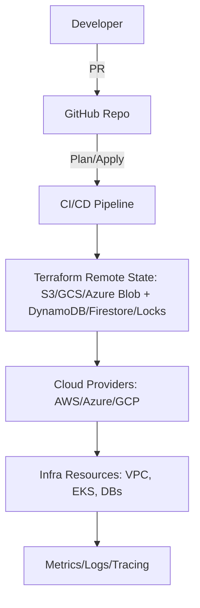

You are a staff-level Cloud Engineer writing a **Terraform Operations Playbook**.  
The output should feel like a production-grade guide covering security, cost, compliance, and resilience.

Prompt: sample-prompt
Tool: Terraform / IaC

---
## 1) Executive Summary
Terraform enables **declarative, auditable, multi-cloud IaC**.  
This playbook provides a **secure, cost-aware, and resilient workflow** for engineering teams.

---
## 2) Architecture Diagram


---
## 3) Runbook: Step-by-Step

### a) Development Workflow
1. Write HCL modules in `modules/`.  
2. Add variable validation + defaults.  
3. Use `terraform fmt` and `terraform validate` pre-commit.  

### b) Plan & Apply
```bash
terraform init -backend-config=backend.hcl
terraform plan -out=tfplan
terraform apply tfplan
```
- Always review plan output in PRs.  
- Require peer approval for `terraform apply`.  

### c) State Management
- Store state remotely (S3/DynamoDB, GCS/Firestore, Azure Blob/Locks).  
- Enable **state locking** to prevent concurrent applies.  
- Back up state daily.  

### d) Security & Compliance
- Use least-privilege IAM for Terraform execution.  
- Encrypt state at rest (KMS, CMK) + in transit (TLS).  
- Enforce policies with Sentinel, OPA/Conftest, or Terraform Cloud Policy Sets.  

### e) Cost & Performance
- Rightsize instances & use spot/savings plans.  
- Run `infracost` in CI to show cost impact in PRs.  
- Prefer reusable modules → avoid drift + waste.  

### f) Resilience
- Use multi-AZ resources (RDS, ASG, EKS).  
- Keep modules idempotent & safe for reapply.  
- Implement DR: replicate state to another region.  

### g) Observability
- Add logging/metrics for Terraform runs.  
- Alert on failed applies.  
- Track drift with `terraform plan` in scheduled jobs.  

---
## 4) Risks & Trade-offs
❌ Local state → corruption, data loss → ✅ remote state + locking.  
❌ Over-privileged IAM → security risk → ✅ least-privilege service accounts.  
❌ Unreviewed applies → outages → ✅ enforce CI approvals.  
❌ No cost visibility → budget overruns → ✅ add Infracost.  

---
## 5) Compliance & Governance
- PCI/GDPR/ISO27001: enforce encryption & access control.  
- Maintain audit logs of applies.  
- Use signed modules/providers.  

---
## 6) Quick Wins
- Enable remote state + locking today.  
- Add `infracost` GitHub Action for PRs.  
- Automate drift detection nightly.  
- Standardize on golden Terraform modules.  
- Add policy-as-code checks before apply.  

[END OF TEMPLATE]